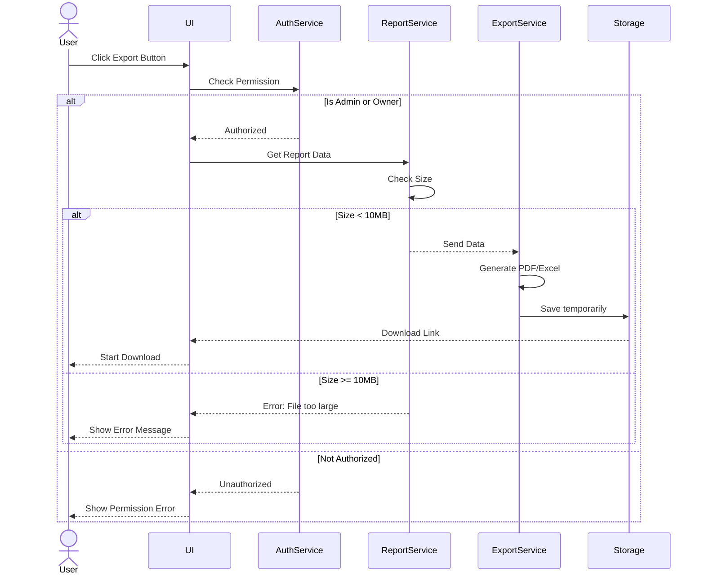

# Anweisungen für KI-Agenten

## ⛔ UNVERHANDELBARE REGELN

Diese Regeln gelten IMMER und dürfen NIEMALS übersprungen werden:

1. **ALLE Tests ausführen** – Vor jedem Commit MÜSSEN alle Tests grün sein
2. **100% Coverage für neuen Code** – Coverage darf NIEMALS sinken
3. **Zeige Test-Output** – Präsentiere dem Menschen die Test-Ergebnisse VOR dem Commit
4. **Keine Linter-Disables** – Niemals `rubocop:disable` oder ähnliche Kommentare

### Validierungs-Checkpoint (VOR jedem Commit):
```bash
# 1. Alle Tests ausführen / Coverage prüfen
rake coverage

# Coverage für neue Dateien: 100%
# Gesamt-Coverage: darf nicht sinken

# 2. Brakeman und rubocop Analyse
* Warning nicht ignorieren/muten. Das Problem lösen.
* Falls das nicht sinnvoll ist den Mensch um Erlaubnis fragen.
# 3. Zeige validierungsoutput dem Menschen
```

**STOP!** Wenn einer dieser Punkte fehlschlägt → Der task ist nicht abgeschlossen Problem lösen.


## Übersicht
Dieses Dokument enthält Richtlinien für KI-Agenten, die an diesem Projekt arbeiten.

## Wichtige Projektdateien

### ✅ Immer lesen (bei jedem Feature):
- **Diese Datei (AGENTS.md)**: Workflows und Best Practices für die Zusammenarbeit
- **GLOSSARY.md**: Domänenspezifische Begriffe und Definitionen
- **docs/architecture/README.md**: System-Übersicht und Architektur-Prinzipien
- **docs/features/README.md**: Feature-Index - zeigt welche Features existieren

### 📋 Nur bei Bedarf lesen:
- **docs/architecture/decisions/XXX-*.md**: Spezifische Architektur-Entscheidungen (nur relevante)
- **docs/features/[feature-name]/**: Feature-spezifische Dokumentation (nur wenn relevant)

### ⚡ Token-sparende Such-Strategie:

```
1. Start: docs/features/README.md (Feature-Index)
   → Welche Features sind ähnlich/relevant?

2. Relevantes Feature: docs/features/[name]/README.md
   → Übersicht des Features

3. Bei Bedarf: Spezifische Diagramme
   → flow.md / sequence.md / ui-mockup.md

4. Bei Architektur-Fragen: docs/architecture/decisions/
   → Nur relevante ADRs
```

**Wichtig:** Lies nicht alle Dateien! Nutze die Index-Dateien (README.md) um zu entscheiden, was relevant ist.

---

## Workflow für neue Features

**Übersicht der Phasen:**
1. Anforderungen verstehen
2. Gherkin-Scenario erstellen
3. Visualisierung & Design (für größere Features)
4. **Dokumentation ablegen** ⚠️ Wichtig!
5. Implementierung
6. **Tests schreiben** (100% Coverage!)
7. **Code Quality & Linting** (nur neue Probleme beheben!)
8. **Feature-Index aktualisieren** (sonst wird Feature nicht gefunden!)
9. **Commit erstellen** (mit menschlichem Review vor Push)

---

### 1. Anforderungen verstehen

**WICHTIG: Bei inhaltlich wichtigen Änderungen immer den Menschen fragen!**

Wenn du ein neues Feature entwickeln sollst:

1. **Stelle Rückfragen**, um das Feature vollständig zu verstehen:
   - Was ist das Ziel des Features?
   - Wer sind die Nutzer?
   - Welche Randfälle gibt es?
   - Gibt es Abhängigkeiten zu anderen Features?
   - Gibt es Performance- oder Sicherheitsanforderungen?

2. **Prüfe das Glossar** (/docs/GLOSSARY.md):
   - Verwende die dort definierten Begriffe konsistent
   - Ergänze neue Domänenbegriffe, wenn nötig

3. **Unterscheide: Kleinigkeiten vs. inhaltliche Änderungen**:

   **✅ Kann eigenständig entschieden werden (Kleinigkeiten):**
   - Button-Text optimieren
   - Fehlermeldungen umformulieren
   - UI-Layout-Details (Abstände, Farben im Rahmen des Design-Systems)
   - Variable/Funktions-Namen
   - Code-Struktur/Refactoring (ohne Verhaltensänderung)

   **❌ IMMER den Menschen fragen (inhaltliche Änderungen):**
   - Neue Features hinzufügen
   - Bestehende Features ändern oder entfernen
   - Business-Logik ändern
   - Datenmodell ändern
   - API-Schnittstellen ändern
   - Validierungsregeln ändern
   - Authorization/Permission-Logik ändern
   - Welche Daten gespeichert/verarbeitet werden
   - User-Flow ändern

   **Beispiel:**
   ```
   ❌ NICHT OK (ohne Fragen):
   "Ich habe gesehen, dass User auch ihre Email-Adresse ändern
   können sollten, also habe ich das Feature hinzugefügt."

   ✅ OK (mit Frage):
   "Der Button-Text 'Absenden' ist generisch. Ich schlage
   'Bericht exportieren' vor - ist das OK?"

   ✅ OK (mit Frage bei inhaltlicher Änderung):
   "Soll der User auch seine Email-Adresse ändern können?
   Das würde eine neue Validierung und Bestätigungs-Email
   erfordern."
   ```

### 2. Gherkin-Scenario erstellen
Nachdem du das Feature verstanden hast:

1. **Schreibe ein Gherkin-Scenario** als Verständnis-Check
2. **Präsentiere es dem Menschen** zur Überprüfung
3. **Warte auf Feedback** - der Mensch kann anpassen
4. **Mache eigene Vorschläge**:
   - Weitere Szenarien für Edge Cases
   - Alternative Happy Paths
   - Error-Handling-Szenarien
   - Performance- oder Sicherheitsaspekte

### 3. Visualisierung & Design (für größere Features)

**Hinweis:** Diese Phase ist primär für ganze Features relevant, nicht für kleine Fixes oder Änderungen. Nutze dein Urteilsvermögen.

Nach der Gherkin-Phase erstelle Visualisierungen, die das gemeinsame Verständnis vertiefen:

1. **Wähle passende Visualisierungen**:
   - **Mermaid-Diagramme**: Für Flows, Architekturen, Sequenzen
   - **ASCII-Art Mockups**: Für UI-Features (werden direkt im Chat dargestellt)
   - **Datenmodelle**: Für Datenbankstrukturen
   - **State Machines**: Für Zustandsübergänge
   - **Sequenzdiagramme**: Für Interaktionen zwischen Komponenten
   - **Nutze Templates**: Unter `docs/templates/` findest du Vorlagen

2. **Präsentiere dem Menschen**:
   - Zeige die Visualisierung
   - Erkläre die wichtigsten Design-Entscheidungen
   - Warte auf Feedback

3. **Diskutiere Änderungen**:
   - Der Mensch kann Anpassungen vorschlagen
   - Iteriere gemeinsam über das Design
   - Kläre offene Fragen

4. **Beispiele für sinnvolle Visualisierungen**:
   - **UI-Features**: Mockup + User Flow
   - **API-Endpoints**: Sequenzdiagramm
   - **State Management**: State Machine Diagram
   - **Datenverarbeitung**: Flowchart
   - **Architektur**: Component Diagram

### 4. Dokumentation ablegen

**WICHTIG: Dokumentiere während der Arbeit, nicht danach!**

Nach der Abstimmung der Visualisierungen:

1. **Erstelle Feature-Ordner** (falls nicht vorhanden):
   ```bash
   mkdir -p docs/features/[feature-name]
   ```

2. **Lege alle Artefakte ab**:
   - **Gherkin-Scenarios**: `docs/features/[feature-name]/feature.gherkin`
   - **Mermaid-Diagramme**: `docs/features/[feature-name]/flow.md` oder `sequence.md`
   - **ASCII-Mockups**: `docs/features/[feature-name]/ui-mockup.md`
   - **Feature-Dokumentation**: `docs/features/[feature-name]/README.md`

3. **Nutze Templates**:
   - Kopiere passende Templates aus `docs/templates/`
   - Fülle sie mit den erstellten Inhalten
   - Entferne nicht benötigte Abschnitte

4. **Aktualisiere Glossar** (wenn neue Begriffe entstanden sind):
   - Ergänze neue Domänenbegriffe in `docs/GLOSSARY.md`
   - Mit deutscher und englischer Variante

**Beispiel:**
```bash
# Template kopieren
cp docs/templates/feature-template.md docs/features/user-export/README.md

# Gherkin ablegen
# (bereits während Phase 2 erstellt)
mv feature.gherkin docs/features/user-export/

# Mermaid-Diagramme in eigene Dateien
echo "# Export Flow\n\n```mermaid\n[dein Diagramm]\n```" > docs/features/user-export/flow.md
```

### 5. Implementierung

Nach Abstimmung und Dokumentation:
- Beginne mit der Implementierung
- Halte dich an die abgestimmten Spezifikationen
- Bei Unklarheiten während der Implementierung: Rückfragen stellen
- **Halte Dokumentation aktuell**: Bei Änderungen während der Implementierung, aktualisiere die Docs

#### Dependencies & Gems

**REGEL: Möglichst KEINE neuen Dependencies!**

Wenn eine neue Dependency notwendig erscheint:

1. **Prüfe Alternativen OHNE Dependency**:
   - Kann es mit Bordmitteln gelöst werden?
   - Ist die Funktionalität bereits in existierenden Gems enthalten?
   - Vorschlag ohne Gem erstellen und vorstellen

2. **Research vor Vorschlag**:
   - **Ruby Toolbox** (https://www.ruby-toolbox.com/) prüfen
   - **Gem-Aktualität**: Letztes Update, aktive Wartung?
   - **Popularität**: Downloads, GitHub Stars
   - **Security**: Bekannte Vulnerabilities?
   - **Dependencies**: Zieht das Gem viele weitere Dependencies?

3. **Mensch muss zustimmen**:
   ```
   Agent: "Für das PDF-Export-Feature gibt es zwei Optionen:

   Option 1 (ohne Gem):
   - Ruby's built-in libraries nutzen
   - Mehr Code, aber keine Dependency
   - Volle Kontrolle

   Option 2 (mit Gem 'prawn'):
   - Gem: prawn (v2.4.0, letztes Update: 2 Monate)
   - Ruby Toolbox Score: 8/10
   - 5M+ Downloads, aktiv maintained
   - Zieht 3 weitere Dependencies
   - Weniger Code, gut getestet

   Welche Option bevorzugst du?"
   ```

4. **Nur aktuelle, gewartete Gems**:
   - ❌ Letztes Update vor > 1 Jahr
   - ❌ Bekannte Security Issues
   - ❌ Deprecated oder archived
   - ✅ Aktiv maintained
   - ✅ Gute Test-Coverage
   - ✅ Klare Dokumentation

**Niemals ohne Rückfrage:**
- `gem install` ausführen
- `Gemfile` ändern
- `package.json` ändern (bei JavaScript)
- `requirements.txt` ändern (bei Python)

#### Performance-Überlegungen

**REGEL: Performance-kritische Entscheidungen mit Mensch besprechen!**

1. **Async-First Approach**:
   - **Langläufige Tasks** (>2 Sekunden): Immer asynchron
   - Nutze Background Jobs (Sidekiq, Resque, etc.)
   - User soll nicht warten müssen

2. **Vor Implementierung klären**:
   ```
   Agent: "Der Report-Export könnte bei großen Dateien 10+ Sekunden dauern.

   Vorschlag: Background Job mit Sidekiq
   - User bekommt Email wenn fertig
   - Kein Blocking des UI
   - Progress-Tracking möglich

   Ist das so in Ordnung?"
   ```

3. **Performance-Metriken dokumentieren**:
   - Erwartete Response Times
   - Datenbank-Query Performance
   - Memory Usage (bei großen Datasets)

4. **Wann Mensch fragen**:
   - Neue Background Job Worker nötig
   - Caching-Strategie ändern
   - Database Indexe hinzufügen
   - N+1 Query Probleme beheben

#### Database Migrations & Rollback

**KRITISCH: Daten dürfen NIEMALS verloren gehen!**

1. **Migrations-Regeln**:
   - **Immer reversibel**: Jede Migration braucht `down`/`rollback`
   - **Zero-Downtime**: App muss während Migration weiterlaufen
   - **Daten bewahren**: Keine Spalten/Tabellen ohne Backup löschen

2. **Migration erstellen**:
   ```ruby
   class AddExportStatusToReports < ActiveRecord::Migration[7.0]
     def up
       add_column :reports, :export_status, :string, default: 'pending'
       add_index :reports, :export_status
     end

     def down
       remove_index :reports, :export_status
       remove_column :reports, :export_status
     end
   end
   ```

3. **Rollback-Strategie dokumentieren**:
   In `docs/features/[feature]/README.md`:
   ```markdown
   ## Database Changes

   ### Migration: AddExportStatusToReports
   - Adds: `reports.export_status` column
   - Default: 'pending'
   - Rollback: Safe - column removal preserves data

   ### Rollback Strategy
   1. Run: `rails db:rollback`
   2. Existing export functionality continues to work
   3. No data loss
   ```

4. **Mensch MUSS reviewen**:
   - ✅ **Vor** Migration ausführen: Zeige Code
   - ✅ **Nach** Migration: Zeige Ergebnis
   - ✅ Rollback-Plan vorstellen

5. **OPS-Team informieren** (via Mensch):
   ```
   Agent: "Diese Migration erfordert OPS-Team Info:

   - Neue Background Job Queue: 'exports'
   - Zusätzlicher Worker nötig
   - Geschätzter Disk Space: +5GB für Export-Dateien

   Soll ich das in der Dokumentation festhalten, damit du es
   an OPS weitergeben kannst?"
   ```

**Niemals ohne Mensch:**
- Migrations ausführen
- Spalten/Tabellen löschen
- Daten-Migration (Daten verändern/verschieben)
- Schema-Änderungen in Production

#### Security

**KRITISCH: Security First - keine simplen OWASP-Fehler!**

1. **Security-Tools einsetzen**:
   - **Ruby**: Brakeman (static analysis)
   - **JavaScript**: npm audit, eslint-plugin-security
   - **Python**: bandit
   - Regelmäßig laufen lassen

2. **Input Validation**:
   - ❌ **NIEMALS** User-Input vertrauen
   - ✅ **IMMER** validieren und sanitizen
   - ✅ Whitelist statt Blacklist
   - ✅ Type checking

   ```ruby
   # ❌ BAD
   Report.where("user_id = #{params[:user_id]}")

   # ✅ GOOD
   Report.where(user_id: params[:user_id])
   ```

3. **Authorization für jedes Feature**:
   Vor Implementierung klären:
   ```
   Agent: "Für das Export-Feature:

   Wer darf darauf zugreifen?
   - Nur Admins?
   - Report-Owner auch?
   - Alle authentifizierten User?

   Mein Vorschlag: Nur Admins + Report Owner"
   ```

4. **Security Checklist**:
   - [ ] Input Validation (alle User-Inputs)
   - [ ] Authorization (wer darf was?)
   - [ ] Authentication (falls relevant)
   - [ ] SQL Injection verhindert (Parameterized Queries)
   - [ ] XSS verhindert (Output Escaping)
   - [ ] CSRF-Protection (für Forms)
   - [ ] Sensitive Data Exposure (Logs, Errors)
   - [ ] File Upload Validation (Type, Size, Content)
   - [ ] Rate Limiting (für APIs)

5. **Brakeman vor Commit**:
   ```bash
   # Ruby
   brakeman --no-pager

   # Bei neuen Warnings
   brakeman -C  # Zeige nur neue Probleme
   ```

6. **Security-Erkenntnisse dokumentieren**:
   Wenn du wichtige Security-Patterns lernst:
   ```
   Agent: "Ich habe erkannt, dass File-Uploads im Projekt
   immer mit ContentTypeValidator validiert werden.

   Soll ich das als ADR dokumentieren?
   'ADR-XXX: File Upload Validation Strategy'"
   ```

7. **Mensch MUSS reviewen**:
   - Alle Authentication/Authorization-Änderungen
   - Security-relevante Features
   - ADRs zu Security-Themen

**OWASP Top 10 vermeiden:**
- A01: Broken Access Control → Immer Authorization prüfen
- A02: Cryptographic Failures → Keine Plaintext-Secrets
- A03: Injection → Parameterized Queries, Input Validation
- A04: Insecure Design → Security in Planning-Phase bedenken
- A05: Security Misconfiguration → Defaults nicht ändern ohne Grund
- A07: Identification & Auth Failures → Starke Auth nutzen
- A08: Software & Data Integrity → Dependencies prüfen
- A09: Security Logging Failures → Errors nicht ignorieren
- A10: SSRF → URL-Inputs validieren

---

### 6. Tests schreiben

**WICHTIG: Neuer Code muss 100% Code Coverage haben!**

Nach der Implementierung (oder idealerweise während - TDD):

1. **Gherkin Step Definitions verkabeln**:
   - Implementiere die Step Definitions für die Gherkin-Scenarios
   - Framework: Cucumber (Ruby), Cucumber-js (JavaScript), Behave (Python), etc.
   - Ort: Typischerweise `features/step_definitions/` oder ähnlich
   - Stelle sicher, dass alle Scenarios ausführbar sind

2. **Unit Tests schreiben**:
   - Verwende das projekt-spezifische Test-Framework (RSpec, Jest, pytest, etc.)
   - **100% Code Coverage für neuen Code** ist Pflicht
   - Test-Kategorien:
     - Happy Path
     - Edge Cases
     - Error Handling
     - Boundary Conditions

3. **Code Coverage prüfen**:
   ```bash
   # Beispiele für verschiedene Frameworks
   # Ruby: SimpleCov
   # JavaScript: Jest --coverage
   # Python: pytest --cov
   ```
   - Neuer Code muss 100% Coverage erreichen
   - Bestehender Code: Coverage nicht verschlechtern

### 7. Code Quality & Linting

**KRITISCH: Linter-Konfigurationen NICHT ändern!**

1. **Verwende bestehende Tools**:
   - **Ruby**: Rubocop
   - **JavaScript**: StandardJS, ESLint
   - **Python**: Pylint, Flake8, Black
   - **Andere**: Projekt-spezifische Linter

2. **Automatisches Beheben von Problemen**:
   - ✅ **NUR** Probleme in **neu erstellten oder modifizierten Dateien** beheben
   - ✅ **NUR** Probleme beheben, die **neu entstanden** sind
   - ❌ **NICHT** bestehende Probleme in unveränderten Dateien beheben
   - ❌ **NIEMALS** Linter-Konfigurationen (`.rubocop.yml`, `.eslintrc`, etc.) ändern

3. **Workflow**:
   ```bash
   # 1. Linter auf geänderte Dateien laufen lassen
   rubocop path/to/modified/file.rb

   # 2. Auto-fix nur wenn sicher
   rubocop -a path/to/modified/file.rb

   # 3. Bei Unsicherheit: Rückfragen beim Menschen
   ```

4. **Bei Linter-Fehlern**:
   - Behebe den Code, **nicht die Konfiguration**
   - Wenn unklar, warum ein Fehler auftritt: Frage den Menschen
   - Wenn ein Linter-Fehler wirklich falsch ist: Frage den Menschen, ob die Konfiguration angepasst werden soll

5. **NIEMALS `rubocop:disable` Kommentare verwenden**:
   - ❌ **VERBOTEN**: `# rubocop:disable Metrics/MethodLength` oder ähnliche Kommentare
   - ✅ **STATTDESSEN**: Code refaktorieren um das Problem zu lösen
   - Bei zu langen Methoden: In kleinere Methoden extrahieren
   - Bei zu hoher Komplexität: Logic in Concerns, Service Objects, oder Helper-Klassen auslagern
   - Bei zu langen Klassen: In Module/Concerns aufteilen

   **Beispiel:**
   ```ruby
   # ❌ FALSCH - Problem verstecken
   # rubocop:disable Metrics/ClassLength
   class BigController < ApplicationController
     # 200 Zeilen Code...
   end
   # rubocop:enable Metrics/ClassLength

   # ✅ RICHTIG - Problem lösen durch Refactoring
   class SmallController < ApplicationController
     include RoutingConcern
     include ImageServingConcern
     # Jetzt nur noch 50 Zeilen
   end
   ```

**Beispiel-Workflow:**
```bash
# Nach Implementierung
git diff --name-only  # Liste geänderte Dateien

# Linting nur auf geänderten Dateien
rubocop app/models/new_feature.rb app/controllers/reports_controller.rb

# Auto-fix
rubocop -a app/models/new_feature.rb

# Tests laufen lassen
rspec spec/models/new_feature_spec.rb
cucumber features/export_reports.feature

# Coverage prüfen
bundle exec rspec --coverage
```

### 8. Feature-Index aktualisieren

**KRITISCH: Ohne Index-Update wird das Feature nicht gefunden!**

Nach erfolgreichen Tests und Linting:

1. **Aktualisiere `docs/features/README.md`**:
   ```markdown
   | Feature | Status | Beschreibung | Verzeichnis |
   |---------|--------|--------------|-------------|
   | Report Export | completed | Export reports as PDF/Excel | `report-export/` |
   ```

2. **Füge Feature zur passenden Kategorie hinzu**:
   - Unter "Data Management" oder passender Kategorie
   - Eintrag hinzufügen in der Kategorie-Liste

3. **Verlinke relevante ADRs** (falls vorhanden):
   ```markdown
   | ADR | Thema | Betroffene Features |
   |-----|-------|---------------------|
   | 003 | File Export Strategy | report-export, data-export |
   ```

**Wichtig:**
- Pflege-Dateien müssen aktuell bleiben: `docs/features/README.md`, `docs/architecture/README.md`
- Diese sind Pflichtlektüre für AI-Agenten - veraltete Infos führen zu Problemen

### 9. Commit erstellen

**WICHTIG: Mensch muss vor Push sein OK geben!**

1. **Erstelle aussagekräftigen Commit**:
   ```bash
   git add docs/features/report-export/
   git add app/models/report_exporter.rb
   git add spec/models/report_exporter_spec.rb
   # ... weitere geänderte Dateien

   git commit -m "$(cat <<'EOF'
   Add report export feature

   - Implement PDF and Excel export for reports
   - Add size validation (max 10MB)
   - Add permission checks (Admin/Owner only)
   - Include Gherkin scenarios and documentation
   - 100% test coverage achieved

   Co-Authored-By: Claude Sonnet 4.5 <noreply@anthropic.com>
   EOF
   )"
   ```

2. **Zeige Commit-Details dem Menschen**:
   ```bash
   git show HEAD
   ```

3. **Warte auf Bestätigung** bevor du pushst:
   - "Soll ich den Commit pushen?"
   - "Soll ich einen Pull Request erstellen?"

**Niemals ohne Rückfrage:**
- Push zu main/master
- Force push
- Pull Request erstellen (ohne Bestätigung)

---

## Gherkin-Vorlage

**WICHTIG: Gherkin-Scenarios IMMER auf Englisch schreiben!**

```gherkin
Feature: [Feature Name]
  As a [Role/User]
  I want to [Goal]
  So that [Benefit/Reason]

  Scenario: [Scenario Description]
    Given [Initial State]
    And [Additional Precondition]
    When [Action]
    Then [Expected Result]
    And [Additional Expected Result]
```

---

## Kommunikationsrichtlinien

### Rückfragen stellen
- **Immer nachfragen**, wenn etwas unklar ist
- Lieber eine Frage zu viel als eine zu wenig
- Konkrete Fragen stellen, keine allgemeinen

### Vorschläge machen
- Proaktiv Verbesserungen vorschlagen
- Alternativen aufzeigen
- Potenzielle Probleme frühzeitig ansprechen

### Domänensprache verwenden
- Begriffe aus GLOSSARY.md verwenden
- Neue Begriffe ins Glossar aufnehmen
- Konsistente Terminologie in Code und Dokumentation

---

## Dokumentations-Pflege

### Glossar pflegen

Wenn du einen neuen Domänenbegriff identifizierst:
1. Prüfe, ob er bereits in GLOSSARY.md existiert
2. Wenn nicht, füge ihn mit klarer Definition hinzu (DE + EN)
3. Verwende den Begriff konsistent im Code

Bei Unklarheiten über bestehende Begriffe:
- Frage den Menschen
- Aktualisiere GLOSSARY.md mit der Klärung

### Diagramme und Visualisierungen ablegen

**Regel: Alle Diagramme gehören in die Dokumentation!**

1. **Mermaid-Diagramme**:
   - Lege sie in separaten `.md` Dateien ab
   - Ort: `docs/features/[feature-name]/[diagramm-typ].md`
   - Typen: `flow.md`, `sequence.md`, `architecture.md`, `state-machine.md`

2. **ASCII-Art Mockups**:
   - Separate Datei: `docs/features/[feature-name]/ui-mockup.md`
   - Nutze Template: `docs/templates/ui-mockup-template.md`

3. **Gherkin-Scenarios**:
   - Immer als `.gherkin` Datei ablegen
   - Ort: `docs/features/[feature-name]/feature.gherkin`

4. **Feature-Übersicht**:
   - `docs/features/[feature-name]/README.md`
   - Referenziert alle anderen Dateien
   - Erklärt Zusammenhänge

**Warum ist das wichtig?**
- ✅ Du kannst später auf existierende Diagramme zurückgreifen
- ✅ Konsistenz über Features hinweg
- ✅ Andere Agenten/Menschen verstehen Design-Entscheidungen
- ✅ Lebende Dokumentation statt Chat-History

**Wann ablegen?**
- ⏰ **Sofort nach Abstimmung** mit dem Menschen
- ⏰ **Vor der Implementierung** (nicht danach!)
- ⏰ **Bei Änderungen** während der Implementierung aktualisieren

---

## Beispiel-Workflow

```
Mensch: "Implementiere bitte eine Funktion zum Exportieren von Berichten"

Agent: "Gerne! Ich habe ein paar Rückfragen, um das Feature richtig zu verstehen:
1. Welche Formate sollen unterstützt werden? (PDF, Excel, CSV?)
2. Sollen alle Berichte exportierbar sein oder nur bestimmte?
3. Gibt es Größenbeschränkungen?
4. Wer darf exportieren? (Alle Nutzer oder nur bestimmte Rollen?)

Ich erstelle dann ein Gherkin-Scenario zur Abstimmung."

Mensch: "PDF und Excel, alle Berichte, max 10MB, nur Admins und Report-Owner"

Agent: "Verstanden! Hier ist mein Gherkin-Scenario (auf Englisch):

Feature: Export Reports
  As an Admin or Report Owner
  I want to export reports as PDF or Excel
  So that I can use the data offline

  Scenario: Successful PDF Export
    Given I am logged in as an Admin
    And a report "Q1 Quarterly Results" exists
    And the report is smaller than 10MB
    When I request a PDF export
    Then the download should start
    And the file should be in PDF format

Soll ich noch weitere Szenarien für Excel-Export und Fehlerbehandlung
(z.B. Datei zu groß, keine Berechtigung) hinzufügen?"

Mensch: "Ja, gerne!"

Agent: "Perfekt! Ich ergänze die Szenarien. Soll ich auch ein Mermaid-Diagramm
erstellen, das den Export-Flow visualisiert? Das könnte helfen, die Architektur
zu verstehen."

Mensch: "Ja, das wäre hilfreich"

Agent: "Hier ist der Flow:



Sieht das so sinnvoll aus? Gibt es Anpassungen?"
```

---

## Notizen

### Keine Änderungshistorie in Dokumenten
**Entscheidung:** Es wird keine Änderungshistorie in Dokumenten unter `docs/` geführt - und auch nirgendwo sonst im Code.

Das bedeutet:
- ❌ Keine "Changelog"-Abschnitte in Markdown-Dateien
- ❌ Keine "History" oder "Revision"-Tabellen in Dokumenten
- ❌ Keine Änderungsdaten am Datei-Ende
- ✅ Git-History ist die einzige Quelle für Änderungshistorie
