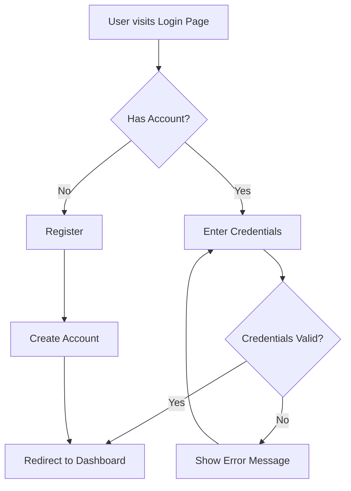

# Best Practices: Mensch-AI-Zusammenarbeit in der Softwareentwicklung

**Für:** Entwickler, Team Leads, Product Owner
**Ziel:** Effektive Zusammenarbeit mit KI-Agenten wie Claude
**Stand:** 2024-01-18

---

## 📖 Inhaltsverzeichnis

1. [Kernprinzipien](#kernprinzipien)
2. [Der 9-Phasen Workflow](#der-9-phasen-workflow)
3. [Kritische Regeln](#kritische-regeln)
4. [Dokumentationsstruktur](#dokumentationsstruktur)
5. [Visualisierungen](#visualisierungen)
6. [Checklisten](#checklisten)
7. [Mensch-AI Verantwortlichkeiten](#mensch-ai-verantwortlichkeiten)
8. [Beispiele](#beispiele)
9. [Erfolgskriterien](#erfolgskriterien)

---

## 🎯 Kernprinzipien

### 1. Gemeinsame Grundlage schaffen

**Problem:** Mensch und AI sprechen oft verschiedene "Sprachen".

**Lösung:**
- **Gherkin** (auf Englisch) als gemeinsame Spezifikationssprache
- **Glossar** (DE + EN) für Domänenbegriffe
- **Index-basierte Dokumentation** für effiziente Suche

**Vorteile von Gherkin:**
- Given-When-Then Struktur ist eindeutig
- Fokus auf Verhalten statt Implementierung
- Dient als lebende Dokumentation
- Basis für automatisierte Tests

### 2. Visualisierung vor Implementierung

**Warum:** Ein Bild sagt mehr als tausend Worte.

**Wie:**
- **Mermaid-Diagramme** für Flows und Architekturen
- **ASCII-Art** für UI-Mockups
- **Gemeinsame Abstimmung** und Iteration

**Ergebnis:** Beide (Mensch & AI) haben das gleiche Verständnis bevor Code geschrieben wird.

### 3. Dokumentation während der Arbeit

**Nicht:** Nachträglich dokumentieren
**Sondern:** Dokumentation ist Teil des Workflows

- Strukturierte Ablage in `docs/`
- Feature-Index aktuell halten
- Diagramme sofort ablegen

### 4. Sicherheit und Qualität

**Non-Negotiables:**
- Security First (Brakeman, OWASP Top 10)
- 100% Code Coverage für neuen Code
- Keine simplen Sicherheitsfehler
- Daten dürfen niemals verloren gehen

---

## 📋 Der 9-Phasen Workflow

Für **größere Features** (nicht für kleine Fixes wie Button-Text-Änderungen):

| # | Phase | Wer macht was | Kritisch |
|---|-------|---------------|----------|
| **1** | **Anforderungen verstehen** | AI fragt nach, Mensch antwortet | Bei inhaltlichen Änderungen immer abstimmen |
| **2** | **Gherkin-Scenarios** | AI schreibt (EN), Mensch reviewt | Verständnis-Check |
| **3** | **Visualisierung** | AI erstellt, beide diskutieren | Nur für größere Features |
| **4** | **Dokumentation ablegen** | AI dokumentiert | ⚠️ VOR Implementierung! |
| **5** | **Implementierung** | AI + Mensch | Dependencies, Performance, DB, Security abstimmen |
| **6** | **Tests schreiben** | AI | 100% Coverage Pflicht |
| **7** | **Code Quality** | AI | Linting, nur neue Probleme |
| **8** | **Feature-Index** | AI | ⚠️ Sonst wird Feature nicht gefunden! |
| **9** | **Commit & Review** | Mensch gibt OK | Vor Push/PR |

---

## 🚨 Kritische Regeln

### Was AI NIEMALS ohne deine Zustimmung macht:

#### 🔧 Dependencies
- ❌ Keine neuen Gems/Packages ohne Zustimmung
- ❌ Gemfile/package.json nicht ändern
- ✅ AI schlägt ZWEI Optionen vor: Mit und ohne Dependency
- ✅ Research: Ruby Toolbox, Aktualität, Security

**Beispiel:**
```
AI: "Für PDF-Export gibt es zwei Optionen:

Option 1 (ohne Gem): Ruby built-in, mehr Code, volle Kontrolle
Option 2 (mit Gem 'prawn'): v2.4.0, aktiv maintained, 5M+ Downloads

Welche bevorzugst du?"
```

#### 💾 Database
- ❌ Keine Migrations ohne Review (vor & nach!)
- ❌ Keine Spalten/Tabellen löschen
- ❌ Keine Daten-Migration ohne Plan
- ✅ Immer reversibel (up/down)
- ✅ Rollback-Strategie dokumentiert
- ✅ Zero-Downtime

#### 🔒 Security
- ❌ Keine Authorization-Änderungen ohne Review
- ❌ Niemals User-Input vertrauen
- ✅ Brakeman vor Commit
- ✅ Für jedes Feature: "Wer darf zugreifen?"
- ✅ OWASP Top 10 vermeiden

#### 🎨 Code Quality
- ❌ NIEMALS Linter-Konfigurationen ändern
- ❌ Keine bestehenden Probleme in unveränderten Dateien beheben
- ✅ Nur neue Probleme in geänderten Dateien

#### 📝 Commits & Deployment
- ❌ Kein Push ohne Bestätigung
- ❌ Kein Force Push
- ❌ Kein Pull Request ohne OK

#### 💡 Inhaltliche Änderungen

**AI kann eigenständig entscheiden (Kleinigkeiten):**
- Button-Text optimieren
- Fehlermeldungen umformulieren
- UI-Layout-Details (im Rahmen des Design-Systems)
- Variable/Funktions-Namen
- Code-Refactoring (ohne Verhaltensänderung)

**AI MUSS fragen (inhaltliche Änderungen):**
- Neue Features hinzufügen
- Business-Logik ändern
- Datenmodell ändern
- API-Schnittstellen ändern
- Validierungsregeln ändern
- Authorization-Logik ändern
- User-Flow ändern

---

## 📁 Dokumentationsstruktur

**Design-Prinzip:** Index-basierte Navigation für Menschen & token-effiziente Suche für AI

```
project/
├── docs/
│   ├── AGENTS.md                    # Workflow & Regeln für AI
│   ├── GLOSSARY.md                  # Domänensprache (DE + EN)
│   ├── BEST-PRACTICES.md            # Dieses Dokument (für Menschen)
│   │
│   ├── architecture/
│   │   ├── README.md                # ⭐ Architektur-Index
│   │   ├── system-overview.md       # Detail-Architektur
│   │   ├── data-flow.md             # Datenflüsse
│   │   └── decisions/               # ADRs
│   │       ├── 001-authentication.md
│   │       └── 002-database-choice.md
│   │
│   ├── features/
│   │   ├── README.md                # ⭐ Feature-Index
│   │   └── [feature-name]/
│   │       ├── README.md            # Feature-Übersicht
│   │       ├── feature.gherkin      # Gherkin (EN)
│   │       ├── flow.md              # Mermaid Flow
│   │       ├── sequence.md          # Mermaid Sequence
│   │       └── ui-mockup.md         # ASCII Mockups
│   │
│   └── templates/                   # Vorlagen
```

**⭐ = Index-Datei:** Immer zuerst schauen für schnellen Überblick

### Warum diese Struktur?

**Für Menschen 👤:**
- Zentrale Anlaufstelle für Dokumentation
- Schnelles Onboarding neuer Team-Mitglieder
- Nachvollziehbare Design-Entscheidungen
- Übersichtstabellen zeigen alles auf einen Blick

**Für AI 🤖:**
- Token-effizient: Nur 3-4 Dateien statt 20+ durchsuchen
- Schnelle Relevanz-Prüfung durch Index-Dateien
- Gezielte Auswahl relevanter Dokumentation
- **~84% weniger Token-Verbrauch!**

**Geteilter Space:**
- Beide nutzen die gleiche Wissensbasis
- Dokumentation entsteht während der Entwicklung
- Balance zwischen Vollständigkeit und Effizienz

---

## 🎨 Visualisierungen

### Verfügbare Typen

| Typ | Tool | Wofür | Beispiel |
|-----|------|-------|----------|
| **User Flow** | Mermaid Graph | Nutzer-Interaktionen | Login-Flow |
| **Sequence** | Mermaid Sequence | API/Service-Calls | Auth-Service |
| **State Machine** | Mermaid State | Zustandsübergänge | Order Status |
| **UI Mockup** | ASCII-Art | Layout/Interface | Dashboard |
| **Architecture** | Mermaid Graph | System-Komponenten | High-Level |

### Wann welche Visualisierung?

- **UI-Features:** Mockup + User Flow
- **API-Endpoints:** Sequenzdiagramm
- **State Management:** State Machine
- **Datenverarbeitung:** Flowchart
- **Architektur:** Component Diagram

---

## ✅ Checklisten

### Für neue Features

- [ ] Anforderungen geklärt (Rückfragen gestellt)
- [ ] Inhaltliche Änderungen abgestimmt
- [ ] Gherkin-Scenarios geschrieben (EN)
- [ ] Visualisierungen erstellt (bei größeren Features)
- [ ] Dokumentation abgelegt (VOR Implementierung)
- [ ] Dependencies geprüft (Alternative ohne?)
- [ ] Performance-Strategie (Async bei >2s?)
- [ ] Security gecheckt (Wer darf zugreifen?)
- [ ] Implementierung abgeschlossen
- [ ] 100% Code Coverage erreicht
- [ ] Linter passed (nur neue Probleme)
- [ ] Brakeman/Security-Scan passed
- [ ] Feature-Index aktualisiert
- [ ] Commit erstellt
- [ ] **Du hast OK gegeben** ✅

### Für Database Migrations

- [ ] Migration ist reversibel (up/down)
- [ ] Rollback-Strategie dokumentiert
- [ ] Zero-Downtime kompatibel
- [ ] Keine Daten gehen verloren
- [ ] **Du hast Migration-Code reviewed**
- [ ] **Du hast OK gegeben**
- [ ] OPS-Team informiert (falls nötig)
- [ ] Nach Migration: **Du hast Ergebnis geprüft**

### Für Security-Features

- [ ] Input Validation implementiert
- [ ] Authorization gecheckt (wer darf was?)
- [ ] Parameterized Queries (SQL Injection)
- [ ] Output Escaping (XSS)
- [ ] CSRF Protection (Forms)
- [ ] File Upload Validation
- [ ] Brakeman scan passed
- [ ] Keine Secrets in Logs
- [ ] **Du hast Security reviewed**

---

## 🤝 Mensch-AI Verantwortlichkeiten

### Was AI eigenständig kann:
- ✅ Kleinere Formulierungen (Button-Text)
- ✅ Code-Struktur/Refactoring (ohne Verhaltensänderung)
- ✅ Linting (neue Probleme in geänderten Dateien)
- ✅ Tests schreiben
- ✅ Dokumentation ablegen
- ✅ Feature-Index aktualisieren

### Was AI mit dir abstimmen muss:
- 🤝 Neue Features
- 🤝 Business-Logik-Änderungen
- 🤝 Datenmodell-Änderungen
- 🤝 API-Änderungen
- 🤝 Dependencies hinzufügen
- 🤝 Performance-Architektur
- 🤝 Database Migrations
- 🤝 Security-Änderungen
- 🤝 Commits pushen

### Was AI NIEMALS alleine macht:
- ❌ Linter-Konfigurationen ändern
- ❌ Migrations ausführen
- ❌ Daten löschen
- ❌ Production-Deployments
- ❌ Force Push
- ❌ Secrets/Credentials ändern

---

## 📚 Beispiele

### Beispiel 1: Gherkin-Spezifikation (immer auf Englisch)

```gherkin
Feature: User Authentication
  As a user
  I want to securely log in
  So that my data is protected

  Scenario: Successful Login
    Given a registered user with email "user@example.com"
    And the correct password "SecurePass123"
    When the user attempts to log in
    Then the login should be successful
    And the user should be redirected to the dashboard
```

### Beispiel 2: Mermaid User Flow



### Beispiel 3: ASCII-Art UI-Mockup

```
┌─────────────────────────────────────────────────────────────────┐
│                          🏢 MyApp                                │
│   [Home]  [Features]  [Pricing]  [About]       [Login] [SignUp] │
├─────────────────────────────────────────────────────────────────┤
│                                                                   │
│                     ┌───────────────────────┐                    │
│                     │   Welcome Back! 👋    │                    │
│                     │                       │                    │
│                     │  Email                │                    │
│                     │  ┌─────────────────┐  │                    │
│                     │  │ user@example.com│  │                    │
│                     │  └─────────────────┘  │                    │
│                     │                       │                    │
│                     │  Password             │                    │
│                     │  ┌─────────────────┐  │                    │
│                     │  │ ••••••••••••••  │  │                    │
│                     │  └─────────────────┘  │                    │
│                     │                       │                    │
│                     │  ☑ Remember me        │                    │
│                     │                       │                    │
│                     │  ┌─────────────────┐  │                    │
│                     │  │   [LOGIN] ✓     │  │                    │
│                     │  └─────────────────┘  │                    │
│                     │                       │                    │
│                     │  Forgot password?     │                    │
│                     └───────────────────────┘                    │
│                                                                   │
├─────────────────────────────────────────────────────────────────┤
│  © 2024 MyApp  |  Privacy  |  Terms  |  Contact                 │
└─────────────────────────────────────────────────────────────────┘
```

### Beispiel 4: Typischer Workflow-Dialog

```
Du: "Implementiere bitte eine Funktion zum Exportieren von Berichten"

AI: "Gerne! Ich habe ein paar Rückfragen:
1. Welche Formate? (PDF, Excel, CSV?)
2. Alle Berichte oder nur bestimmte?
3. Größenbeschränkungen?
4. Wer darf exportieren?"

Du: "PDF und Excel, alle Berichte, max 10MB, nur Admins und Report-Owner"

AI: "Verstanden! Hier ist mein Gherkin-Scenario zur Abstimmung:

Feature: Export Reports
  As an Admin or Report Owner
  I want to export reports as PDF or Excel
  So that I can use the data offline

  Scenario: Successful PDF Export
    Given I am logged in as an Admin
    And a report 'Q1 Results' exists
    When I request a PDF export
    Then the download should start

Soll ich noch Szenarien für Fehlerbehandlung ergänzen?"

Du: "Ja, gerne!"

AI: "Soll ich auch ein Mermaid-Diagramm für den Flow erstellen?"

Du: "Ja!"

AI: [zeigt Sequenzdiagramm]

Du: "Perfekt! Kannst du loslegen?"

AI: [implementiert, testet, dokumentiert]

AI: "Feature ist fertig! Alle Tests grün, 100% Coverage.
Hier ist der Commit:
[zeigt Commit-Details]

Soll ich pushen?"

Du: "Ja, push es!"
```

---

## 📊 Erfolgskriterien

Ein Feature ist **fertig**, wenn:

- ✅ Gherkin-Scenarios existieren und passen
- ✅ Visualisierungen abgestimmt sind
- ✅ Dokumentation vollständig in `docs/` liegt
- ✅ Feature-Index aktualisiert ist
- ✅ 100% Code Coverage erreicht ist
- ✅ Alle Tests (Unit + Integration + Gherkin) grün sind
- ✅ Linter passed
- ✅ Brakeman/Security-Scan passed
- ✅ **Du hast reviewed und OK gegeben**
- ✅ Commit erstellt (wartet auf dein Push-OK)

---

## 🎓 Lernende Dokumentation

### ADRs für wichtige Erkenntnisse

Wenn AI wichtige Patterns lernt, dokumentiert sie diese als Architecture Decision Record (ADR):

- Security-Patterns → ADR
- Performance-Patterns → ADR
- Architektur-Entscheidungen → ADR

**Du reviewst alle ADRs!**

**Beispiel:**
```
AI: "Ich habe erkannt, dass File-Uploads im Projekt
immer mit ContentTypeValidator validiert werden.

Soll ich das als ADR dokumentieren?
'ADR-XXX: File Upload Validation Strategy'"

Du: "Ja, gute Idee!"
```

---

## 💰 Token-Effizienz

Durch die Index-basierte Struktur spart AI ~84% an Tokens:

**Ohne Index (alte Struktur):**
- Glob docs/features/** (1 Tool Call)
- Read 10 Feature READMEs (10 Reads)
- Read 5 irrelevante Diagramme (5 Reads)
- **= ~50,000 Tokens**

**Mit Index (neue Struktur):**
- Read features/README.md (1 Read)
- Read 2 relevante Feature READMEs (2 Reads)
- Read 1 relevantes Diagramm (1 Read)
- **= ~8,000 Tokens**

**Einsparung: 84%** 🎉

---

## 📚 Weitere Ressourcen

- **Gherkin**: https://cucumber.io/docs/gherkin/reference/
- **Mermaid**: https://mermaid.js.org/
- **ADRs**: https://adr.github.io/
- **OWASP Top 10**: https://owasp.org/Top10/
- **Ruby Toolbox**: https://www.ruby-toolbox.com/

---

## 💡 TL;DR (Zusammenfassung)

> **"Gemeinsam planen (Gherkin + Visualisierung), strukturiert dokumentieren (Index-basiert), sicher implementieren (Security + 100% Coverage), bei inhaltlichen Änderungen immer abstimmen, und du gibst das finale OK."**

### Die wichtigsten Punkte:

1. 📝 **Gherkin** (EN) als gemeinsame Spezifikationssprache
2. 🎨 **Visualisierungen** vor der Implementierung abstimmen
3. 📁 **Index-basierte Dokumentation** für Effizienz
4. 🔒 **Security First** - keine OWASP-Fehler
5. 🧪 **100% Coverage** für neuen Code
6. 💾 **Daten niemals verlieren** - immer Rollback-Strategie
7. 🤝 **Inhaltliche Änderungen** immer abstimmen
8. ✅ **Du gibst OK** bei Dependencies, Migrations, Security, Commits

---

_Erstellt: 2024-01-18
Version: 1.0
Für: Effektive Mensch-AI-Zusammenarbeit in der Softwareentwicklung_
