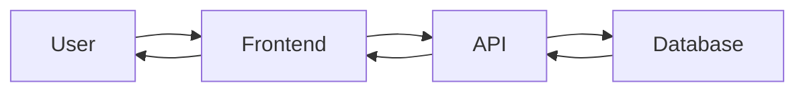

# Architektur-Übersicht

## Zweck
Schneller Überblick über die System-Architektur für Menschen und AI-Agenten. Detaillierte Entscheidungen siehe `decisions/`.

---

## High-Level System-Architektur

```mermaid
graph TB
    subgraph "Frontend"
        UI[User Interface]
    end

    subgraph "Backend"
        API[API Layer]
        Business[Business Logic]
        Data[Data Access]
    end

    subgraph "External"
        DB[(Database)]
        Cache[(Cache)]
        External[External Services]
    end

    UI --> API
    API --> Business
    Business --> Data
    Data --> DB
    Business --> Cache
    Business --> External
```

_Ersetze dieses Diagramm mit der tatsächlichen System-Architektur_

---

## Technologie-Stack

### Frontend
- Framework: _[React/Vue/Angular/etc.]_
- State Management: _[Redux/Vuex/etc.]_
- UI Library: _[Material-UI/etc.]_

### Backend
- Language: _[Ruby/Node.js/Python/etc.]_
- Framework: _[Rails/Express/Django/etc.]_
- API Style: _[REST/GraphQL/gRPC]_

### Database
- Primary: _[PostgreSQL/MySQL/MongoDB/etc.]_
- Cache: _[Redis/Memcached/etc.]_

### Infrastructure
- Hosting: _[AWS/Azure/GCP/Heroku/etc.]_
- CI/CD: _[GitHub Actions/Jenkins/etc.]_

---

## Wichtige Architektur-Prinzipien

1. **Separation of Concerns**
   - _Beschreibung wie dies umgesetzt wird_

2. **DRY (Don't Repeat Yourself)**
   - _Beschreibung_

3. **SOLID Principles**
   - _Welche sind besonders wichtig im Projekt?_

---

## Verzeichnisstruktur

```
project/
├── frontend/           # Frontend-Code
├── backend/            # Backend-Code
├── docs/               # Dokumentation
├── tests/              # Tests
└── infrastructure/     # Infrastructure as Code
```

---

## Wichtige Architektur-Entscheidungen (ADRs)

Siehe: `decisions/` für vollständige ADRs

### Übersicht

| ADR | Titel | Status | Datum |
|-----|-------|--------|-------|
| 001 | _Authentication Method_ | _Accepted_ | _YYYY-MM-DD_ |
| 002 | _Database Choice_ | _Accepted_ | _YYYY-MM-DD_ |

---

## Datenfluss

_Füge hier ein High-Level Datenfluss-Diagramm ein, wenn relevant_



---

## Security Considerations

- Authentication: _[JWT/Session/OAuth/etc.]_
- Authorization: _[RBAC/ABAC/etc.]_
- Data Encryption: _[At rest/In transit]_
- Input Validation: _[Where/How]_

---

## Performance Considerations

- Caching Strategy: _[Beschreibung]_
- Database Indexing: _[Strategie]_
- Load Balancing: _[Wenn relevant]_

---

## Navigation

### Für Menschen 👤
- **Übersicht**: Diese Datei zeigt die wichtigsten Architektur-Aspekte
- **Entscheidungen**: `decisions/` Ordner für alle ADRs
- **Details**: `system-overview.md` und `data-flow.md` für tiefere Einblicke

### Für AI-Agenten 🤖

**⚡ Wann diese Datei lesen:**

✅ **Immer lesen bei:**
- Beginn eines neuen Features
- Architektur-Fragen
- Technologie-Auswahl

**📋 Weitere Dateien (nur bei Bedarf):**
- `system-overview.md` → Detail-Architektur
- `data-flow.md` → Datenfluss-Details
- `decisions/XXX-*.md` → Nur relevante ADRs

**🔍 Token-sparender Workflow:**
```
1. Lies diese Datei (README.md) → Übersicht
2. Identifiziere relevante ADRs → Tabelle oben
3. Lies nur relevante ADRs → decisions/
4. Detail-Dateien nur bei Bedarf
```

---

## Wartung

### Beim Hinzufügen einer neuen ADR:
1. Erstelle ADR in `decisions/`
2. Aktualisiere Tabelle oben
3. Verlinke von relevanten Features

### Bei Architektur-Änderungen:
1. Aktualisiere diese Übersicht
2. Erstelle ADR für die Änderung
3. Aktualisiere betroffene Feature-Dokumentationen
4. Aktualisiere `GLOSSARY.md` wenn neue Begriffe entstehen

---

## Änderungshistorie

| Datum | Änderung | Autor |
|-------|----------|-------|
| _YYYY-MM-DD_ | _Initial creation_ | _Name/Agent_ |
