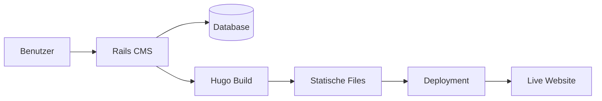

# Architektur-Übersicht

## Zweck
Schneller Überblick über die System-Architektur für Menschen und AI-Agenten. Detaillierte Entscheidungen siehe `decisions/`.

---

## High-Level System-Architektur

```mermaid
graph TB
    subgraph "Browser"
        UI[Rails Views + Stimulus]
    end

    subgraph "Rails Application"
        Controllers[Controllers]
        Models[Models]
        Components[ViewComponents]
        Services[Services]
    end

    subgraph "Build Pipeline"
        Hugo[Hugo Static Site Generator]
    end

    subgraph "Storage"
        DB[(SQLite/PostgreSQL)]
        Storage[File Storage]
    end

    subgraph "Output"
        Static[Static Website Files]
    end

    UI --> Controllers
    Controllers --> Models
    Controllers --> Components
    Controllers --> Services
    Models --> DB
    Services --> Hugo
    Hugo --> Static
    Static --> Storage
```

---

## Technologie-Stack

### Frontend
- Framework: Rails Views (ERB)
- JavaScript: Stimulus (Hotwire)
- CSS: Tailwind CSS
- Components: ViewComponents

### Backend
- Language: Ruby 3.x
- Framework: Ruby on Rails 7
- API Style: Server-rendered HTML (Hotwire)

### Database
- Development: SQLite
- Production: PostgreSQL

### Static Site Generation
- Engine: Hugo
- Output: Statische HTML/CSS/JS Dateien

### Testing
- Unit Tests: RSpec
- Acceptance Tests: Cucumber (Gherkin)
- Coverage: SimpleCov

---

## Wichtige Architektur-Prinzipien

1. **Feature-First Development (BDD)**
   - Gherkin-Scenarios vor Implementierung
   - Siehe ADR-001

2. **Sandi Metz's Rules**
   - Klassen max 100 Zeilen
   - Methoden max 5 Zeilen
   - Max 4 Parameter

3. **Clean Code (Robert Martin)**
   - Sprechende Namen
   - Kleine Funktionen
   - Command-Query Separation

4. **ViewComponents statt Partials**
   - Wiederverwendbare UI-Bausteine
   - Testbar in Isolation

---

## Verzeichnisstruktur

```
cms/
├── app/
│   ├── components/       # ViewComponents
│   ├── controllers/      # Rails Controllers
│   ├── models/           # ActiveRecord Models
│   ├── services/         # Service Objects
│   └── views/            # ERB Templates
├── docs/
│   ├── features/         # Gherkin Feature-Dateien
│   ├── architecture/     # Architektur-Docs & ADRs
│   └── GLOSSARY.md       # Domänensprache
├── features/
│   ├── step_definitions/ # Cucumber Steps
│   └── support/          # Cucumber Config
├── spec/                 # RSpec Tests
└── AGENTS.md             # Workflow für AI-Agenten
```

---

## Wichtige Architektur-Entscheidungen (ADRs)

Siehe: `decisions/` für vollständige ADRs

### Übersicht

| ADR | Titel | Status | Datum |
|-----|-------|--------|-------|
| 001 | BDD Feature-First Development | Accepted | 2026-01-18 |
| 002 | Dokumentationsstruktur | Accepted | 2026-01-18 |
| 003 | Code Coverage Policy | Accepted | 2026-01-18 |

---

## Datenfluss: Content-Erstellung bis Deployment



---

## Security Considerations

- Authentication: Token-basiert (Magic Links)
- Authorization: User-Site-Ownership
- Input Validation: Rails Strong Parameters
- XSS Prevention: Rails Auto-Escaping
- CSRF Protection: Rails Authenticity Token

---

## Navigation

### Für Menschen
- **Übersicht**: Diese Datei zeigt die wichtigsten Architektur-Aspekte
- **Entscheidungen**: `decisions/` Ordner für alle ADRs
- **Workflow**: `AGENTS.md` im Root-Verzeichnis

### Für AI-Agenten

**Wann diese Datei lesen:**
- Beginn eines neuen Features
- Architektur-Fragen
- Technologie-Auswahl

**Token-sparender Workflow:**
```
1. Lies diese Datei (README.md) → Übersicht
2. Identifiziere relevante ADRs → Tabelle oben
3. Lies nur relevante ADRs → decisions/
```

---

## Änderungshistorie

| Datum | Änderung | Autor |
|-------|----------|-------|
| 2026-01-18 | Aktualisiert mit tatsächlicher Architektur und ADRs | Claude |
