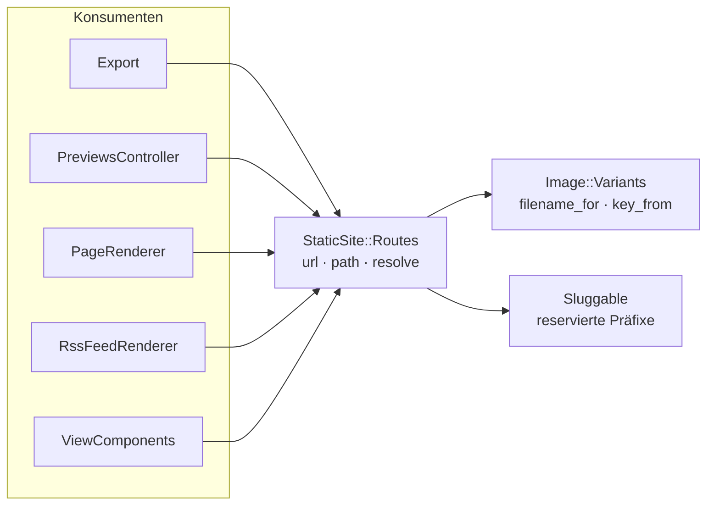

# ADR-006: Static Site Addressing in einem bidirektionalen Modul

## Status
**Proposed**

## Date
2026-08-27

## Context

### Problem Statement

Das URL- und Pfadschema der generierten Site ist eine einzige Entscheidung, war aber in acht
Modulen unabhängig kodiert:

| Modul | Rolle | Spec |
|-------|-------|------|
| `StaticSite::OutputPaths` | Record → Dateipfad | ✅ |
| `StaticSiteHelper` | Record → Link-URL | ✅ |
| `StaticSite::RssFeedRenderer#post_url` | Record → absolute URL | ❌ |
| `PreviewRouting` | Pfad → Record | ❌ |
| `PreviewImageServing` | Pfad → Bildvariante | ❌ |
| `Blocks::Renderer::StaticSiteHtml::Image#variant_url` | Record → Bild-URL | ✅ |
| `Blocks::Renderer::StaticSiteHtml::Book#static_cover_url` | Record → Bild-URL | ✅ |
| `StaticSite::ProjectCardComponent` | Record → Link-URL | ✅ |

Acht Module, acht Meinungen, kein gemeinsames Interface — vier davon ohne eigene Spec. Die
Konvention war nur eine Absprache, und sie ist auseinandergedriftet:

1. **Project-Slug**: `OutputPaths#project_output_path` interpolierte den Slug ungestrippt
   (`projects/#{project.slug}/index.html`), `StaticSiteHelper#static_site_project_url` strippte
   den führenden Schrägstrich. Derselbe Slug erzeugte Schreibpfad und Link unterschiedlich.
2. **Deployment-Target-Identität**: `ExportJob#base_url` verwendete `deployment_target.id`,
   `PreviewsController` `public_id`. Beide lösen auf (`PublicIdable#find` fällt auf `super`
   zurück), aber die interne Datenbank-ID landete in exportierten `feed.xml`-Dateien.
3. **Der Regex-Workaround**: `StaticSiteHelper#static_site_content_html` präfixte fertiges
   Block-HTML per `gsub(%r{/images/}, …)`, weil der Block-Renderer die Site-Root nicht kennt.
   Eine Naht, die fehlt, sichtbar als nachträgliche String-Reparatur.

Ein vierter Befund fiel bei der Analyse ab: `robots.txt` verweist auf eine `sitemap.xml`,
die nirgends erzeugt wird.

### Requirements

- Ein Ort, an dem das Adressschema der Site definiert ist
- Die Rückrichtung (Preview-Routing) muss direkt testbar werden
- Bestehende öffentliche URLs dürfen sich nicht ändern (Ausnahme siehe Consequences)
- Kein neues Gem

---

## Decision

**Wir führen `StaticSite::Routes` ein — ein Modul, das beide Richtungen des Adressschemas
besitzt — und behandeln Preview und Deployed Site als zwei Adressen desselben Inhalts.**

### Rationale

**Beide Richtungen in einem Modul.** Vorwärts (`post_url`, `post_path`) ist reine
String-Arbeit, rückwärts (`resolve`) braucht Datenbankzugriff — zwei Naturen, die eine
Trennung nahelegen würden. Wir trennen sie trotzdem nicht, weil genau die Trennung die
Drift erzeugt hat: zwei Module, die dasselbe Schema unabhängig kodieren, driften
zwangsläufig. Zusammen erlauben sie eine Eigenschaft, die keine Hälfte allein hat:

```ruby
routes.resolve(routes.post_path(post)) == Route.build(:post, record: post)
```

Diese Round-Trip-Property ist als Test formulierbar und macht die Drift strukturell
unmöglich statt nur unwahrscheinlich.

**Preview und Deployed Site sind zwei Adressen, kein Sonderfall.** Bisher lieferte
`ExportJob#base_url` für `internal`-Targets `/preview/<id>/` statt `https://<hostname>/` —
obwohl ein internes Target von Caddy sehr wohl unter seiner `public_hostname` ausgeliefert
wird und der Erfolgs-Notice nach dem Deploy genau dorthin verlinkt. Der Sonderfall war ein
Leck der Preview-Sicht in die Deploy-Sicht. `Routes.for(target, as: :preview | :deployed)`
macht die beiden Sichten zu einem benannten Parameter; der Sonderfall entfällt ersatzlos.

**Zwei URL-Begriffe statt eines.** `base_url` bezeichnete zwei verschiedene Dinge: das
Präfix für interne Links und die absolute externe Adresse für Feed, Sitemap und robots.txt.
Beim Preview fallen sie zufällig zusammen, bei einer Deployed Site nicht. Sie heißen jetzt
**Site-Root** und **Kanonische URL** (siehe [Glossar](../../GLOSSARY.md)); `routes.canonical`
liefert eine zweite `Routes`-Instanz, deren Site-Root die kanonische URL ist.

---

## Options Considered

### Option 1: Nur die Vorwärtsrichtung zusammenziehen
**Description:** `Routes` baut URLs und Pfade, `PreviewRouting` bleibt als eigenes Concern.

**Pros:**
- Kleinerer Eingriff, keine Datenbankzugriffe im neuen Modul
- Trennt sauber nach technischer Natur (String-Arbeit vs. Lookup)

**Cons:**
- Die Rückrichtung bleibt ohne eigene Spec
- Die Round-Trip-Property ist nicht formulierbar — Drift bleibt möglich
- Genau die Aufteilung, die den Ist-Zustand erzeugt hat

---

### Option 2: Rails-Routing wiederverwenden
**Description:** Die Static-Site-Adressen als echte Rails-Routes definieren und
`url_for` / `recognize_path` nutzen.

**Pros:**
- Kein eigenes Modul, bewährte Bidirektionalität

**Cons:**
- Die Adressen sind pro Site dynamisch (Slugs aus der Datenbank), Rails-Routes sind statisch
- Dateipfade (`index.html`) sind kein Rails-Konzept
- Koppelt die Struktur der exportierten Site an die Routing-Tabelle der Anwendung

---

### Option 3: Bidirektionales `StaticSite::Routes` ✅
**Description:** Ein Modul unter `app/utils/static_site/`, das Record → Adresse und
Adresse → Record beherrscht, konstruierbar aus reinen Werten oder aus einem Deployment Target.

**Pros:**
- Round-Trip-Property als Test formulierbar
- Die Präzedenz bei mehrdeutigen Pfaden steht als sichtbare Liste statt in verstreuten Prädikaten
- Die Liste reservierter Präfixe leitet sich aus dem Modul selbst ab, statt doppelt gepflegt zu werden
- Ein Schemawechsel ist ein Edit statt acht koordinierter Edits

**Cons:**
- Ein Modul mit zwei Naturen (String-Arbeit und Datenbankzugriff)
- `resolve` ist auf Site-Ebene gebunden und damit nicht als reine Funktion testbar

**Performance Impact:** `resolve` ersetzt die bisherigen Prädikat-Ketten von `PreviewRouting`
eins zu eins; die Anzahl der Datenbankabfragen pro Preview-Request bleibt gleich.

---

## Consequences

### Positive
- Der Project-Slug-Widerspruch kann nicht wieder entstehen — Schreibpfad und Link entstammen
  derselben Methode
- `PreviewRouting` und `PreviewImageServing` werden erstmals direkt testbar
- `PreviewsController` schrumpft auf Autorisierung, `resolve` und Delegation
- Die reservierten Präfixe werden per `Sluggable` an der Eingabe validiert statt still
  durch Präzedenz aufgelöst

### Negative
- Ein weiteres Modul im `StaticSite`-Namespace, das man kennen muss
- `Routes` braucht eine `Site`-Instanz und ist damit in Specs nicht völlig fixture-frei
  (abgemildert durch den Wert-Konstruktor `new(site:, site_root:, canonical_url:)`)

### Neutral
- **Verhaltensänderung:** Die `feed.xml` einer Deployed Site auf einem `internal`-Target
  enthält künftig `https://<public-hostname>/…` statt `/preview/<id>/…`. Das ist die
  Korrektur aus Punkt 2 oben und bekommt einen eigenen Commit, damit sie beim Bisect nicht
  in einem Refactoring-Commit verborgen liegt.
- `sitemap.xml` wird künftig tatsächlich erzeugt (Home, Posts, Pages, Projects; `loc` und
  `lastmod`), weil `Routes` sonst einen Pfad kodifizieren müsste, den nichts erfüllt.
- `app/jobs/static_site/` enthält danach nur noch die beiden echten ActiveJobs; `PageRenderer`,
  `RssFeedRenderer`, `ImageCollector` und `ParallelProcessor` ziehen nach `app/utils/static_site/`.

---

## Database Changes

### Migrations
- Migration: `NormalizePageAndProjectSlugs`
- Changes: Setzt bei `Page` und `Project` einen fehlenden führenden Schrägstrich im `slug`.
  `Post` ist nicht betroffen (validiert das Format seit jeher).
- Rollback: Die Migration ist verhaltensneutral — `about` und `/about` erzeugen beide
  `about/index.html`, es ändert sich keine öffentliche URL. Ein Down-Migrationsschritt ist
  daher nicht erforderlich; die Änderung ist idempotent wiederholbar.

**Zero-Downtime Compatibility:**
- ✅ App läuft während der Migration weiter
- ✅ Kein Datenverlust
- ✅ Rückwärtskompatibel — `Routes#resolve` normalisiert defensiv und findet Slugs in
  beiden Schreibweisen

---

## Implementation Plan

| # | Schritt | Verhaltensneutral |
|---|---------|-------------------|
| 1 | `Routes` + `Route` anlegen, volle Spec inkl. Round-Trip | ✅ (ungenutzt) |
| 2 | `Image::Variants` um `filename_for` / `key_from` erweitern | ✅ |
| 3 | `Sluggable` + Validierungen + Data-Migration | ✅ |
| 4 | Export-Seite: `OutputPaths` → `Routes` | ✅ |
| 5 | Preview-Seite: `PreviewRouting` / `PreviewImageServing` → `resolve` | ✅ |
| 6 | Views + Components: `@base_url` → `@routes` | ✅ |
| 7 | `Routes.for(target, as:)`, `internal`-Sonderfall entfernen | ⚠️ ändert `feed.xml` |
| 8 | `sitemap.xml` erzeugen | neu |
| 9 | Tote Module löschen | ✅ |

Ausdrücklich **nicht** Teil dieses ADR: der `gsub`-Workaround in `static_site_content_html`.
Er wird auf `@routes.site_root` umgestellt und bleibt, bis der Block-Renderer seine
URL-Erzeugung als Parameter erhält — eine eigene Entscheidung.

---

## Diagrams



---

## References
- [ADR-002: Dokumentationsstruktur](002-documentation-structure.md)
- [ADR-005: Static Sites mit ERB-Templates](005-replace-hugo-with-rails-rendering.md)
- [Glossar](../../GLOSSARY.md) — Site-Root, Kanonische URL, Preview, Deployed Site

---

## Review & Approval

**Reviewed by:**
- [ ] Human Developer

---

## Change History

| Date | Author | Change | Reason |
|------|--------|--------|--------|
| 2026-08-27 | Agent | Created | Ergebnis der Architektur-Analyse zum Adressschema |
