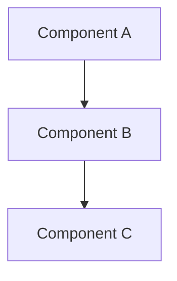

# ADR-XXX: [Short Title]

## Status
**[Proposed | Accepted | Deprecated | Superseded by ADR-YYY]**

## Date
YYYY-MM-DD

## Context
_What is the issue that we're seeing that is motivating this decision or change?_

### Problem Statement
- Clear description of the problem
- Why is this decision needed?
- What constraints exist?

### Requirements
- Functional requirement 1
- Functional requirement 2
- Non-functional requirements (performance, security, etc.)

---

## Decision
_What is the change that we're proposing and/or doing?_

**We will [decision statement].**

### Rationale
- Why this decision was made
- What makes this the best option
- What trade-offs were considered

---

## Options Considered

### Option 1: [Name]
**Description:** Brief description

**Pros:**
- Pro 1
- Pro 2

**Cons:**
- Con 1
- Con 2

**Security Impact:** [If applicable]
**Performance Impact:** [If applicable]

---

### Option 2: [Name]
**Description:** Brief description

**Pros:**
- Pro 1
- Pro 2

**Cons:**
- Con 1
- Con 2

**Security Impact:** [If applicable]
**Performance Impact:** [If applicable]

---

### Option 3: [Chosen Option] ✅
**Description:** Brief description

**Pros:**
- Pro 1
- Pro 2

**Cons:**
- Con 1
- Con 2

**Security Impact:** [If applicable]
**Performance Impact:** [If applicable]

---

## Consequences

### Positive
- Benefit 1
- Benefit 2

### Negative
- Trade-off 1
- Trade-off 2

### Neutral
- Side effect 1
- Side effect 2

---

## Security Considerations

_Critical for security-related ADRs_

- [ ] Input validation strategy
- [ ] Authorization requirements
- [ ] Authentication impacts
- [ ] Data encryption (at rest/in transit)
- [ ] Audit logging requirements
- [ ] OWASP Top 10 considerations
- [ ] Threat model reviewed

**Brakeman/Security Tool Output:**
```
[If applicable: paste relevant security scan results]
```

---

## Performance Considerations

_Critical for performance-related ADRs_

- Expected response times
- Database query performance
- Caching strategy
- Background job requirements
- Memory usage
- Scalability implications

**Benchmarks (if applicable):**
```
[Performance measurements]
```

---

## Database Changes

_Critical for data-related ADRs_

### Migrations
- Migration: `[MigrationClassName]`
- Changes: [What changes]
- Rollback: [Rollback strategy]

### Rollback Strategy
1. Step 1 to rollback
2. Step 2
3. Data preservation plan

**Zero-Downtime Compatibility:**
- ✅ App continues during migration
- ✅ No data loss on rollback
- ✅ Backward compatible

---

## Dependencies

_If new dependencies are introduced_

### New Gems/Packages
| Gem/Package | Version | Reason | Alternatives Considered |
|-------------|---------|--------|------------------------|
| gem-name | 1.2.3 | Why needed | Why not built-in? |

**Due Diligence:**
- [ ] Ruby Toolbox / npm trends checked
- [ ] Last update: [Date] (< 6 months ago)
- [ ] Active maintenance: Yes/No
- [ ] Known vulnerabilities: None found
- [ ] Additional dependencies: [List or "None"]
- [ ] License: [MIT/Apache/etc.]

---

## OPS Considerations

_What OPS team needs to know_

- [ ] New background job queues
- [ ] Additional workers needed
- [ ] Disk space requirements
- [ ] Environment variables
- [ ] External service dependencies
- [ ] Monitoring/alerting needs
- [ ] Deployment order requirements

---

## Implementation Plan

### Phase 1: [Description]
- Task 1
- Task 2

### Phase 2: [Description]
- Task 1
- Task 2

### Migration Path (if applicable)
1. Old system continues to work
2. New system rolled out
3. Data migrated
4. Old system deprecated

---

## Diagrams



---

## References
- [Link to related documentation]
- [Link to related ADR]
- [External resource]
- [OWASP Guide if security-related]
- [Performance benchmarks if applicable]

---

## Review & Approval

**Reviewed by:**
- [ ] Human Developer (Name)
- [ ] Security Review (if security-related)
- [ ] OPS Review (if infrastructure changes)

**Review Notes:**
_Comments from reviews_

---

## Change History

| Date | Author | Change | Reason |
|------|--------|--------|--------|
| YYYY-MM-DD | Agent/Human | Created | Initial proposal |
| YYYY-MM-DD | Human | Approved | Reviewed and accepted |
