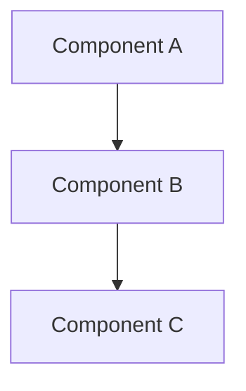

# ADR-XXX: [Short Title of Decision]

## Status
[Proposed | Accepted | Deprecated | Superseded by ADR-YYY]

## Date
YYYY-MM-DD

## Context
_What is the issue that we're seeing that is motivating this decision or change?_

### Current Situation
- Describe the current state
- What problems exist?
- What constraints do we have?

### Requirements
- Functional requirement 1
- Functional requirement 2
- Non-functional requirement 1 (performance, security, etc.)

---

## Decision
_What is the change that we're proposing and/or doing?_

We will [decision statement].

### Rationale
- Why this decision was made
- What makes this the best option
- What trade-offs were considered

---

## Options Considered

### Option 1: [Name]
**Pros:**
- Pro 1
- Pro 2

**Cons:**
- Con 1
- Con 2

### Option 2: [Name]
**Pros:**
- Pro 1
- Pro 2

**Cons:**
- Con 1
- Con 2

### Option 3: [Chosen Option]
**Pros:**
- Pro 1
- Pro 2

**Cons:**
- Con 1
- Con 2

---

## Consequences

### Positive
- Benefit 1
- Benefit 2

### Negative
- Trade-off 1
- Trade-off 2

### Neutral
- Side effect 1
- Side effect 2

---

## Implementation Notes

### What needs to change?
- Component/Module 1
- Component/Module 2

### Migration Strategy (if applicable)
- Step 1
- Step 2

### Timeline
- Phase 1: [Description]
- Phase 2: [Description]

---

## Diagrams

---

## References
- [Link to related documentation]
- [Link to related ADR]
- [External resource]

---

## Review History

| Date | Reviewer | Status | Notes |
|------|----------|--------|-------|
| YYYY-MM-DD | Name | Reviewed | Comments |
