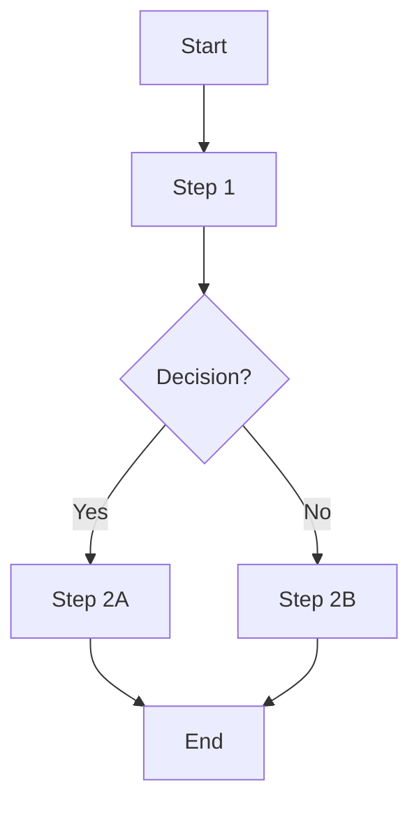
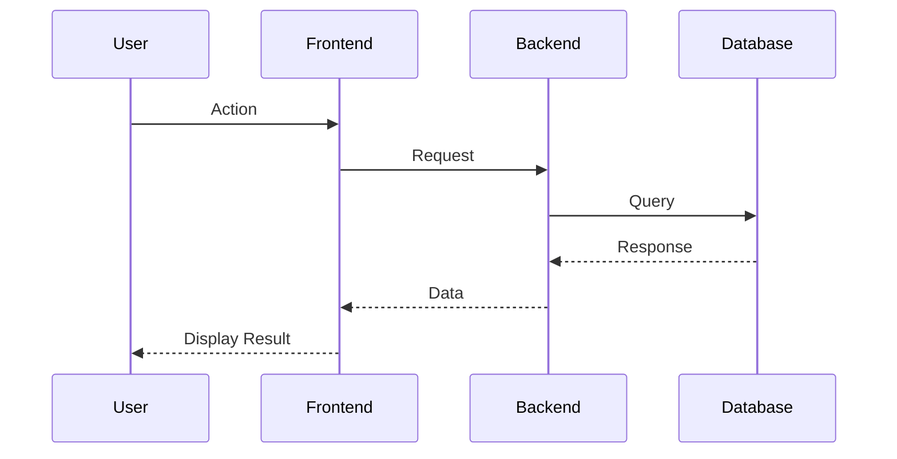

# Feature: [Feature Name]

## Overview
_Brief description of what this feature does and why it's needed_

---

## Gherkin Scenarios

See: `feature.gherkin`

---

## User Flow



---

## Architecture / Sequence Diagram



---

## UI Mockup

```
┌─────────────────────────────────────────────────────┐
│  [Feature Name]                                [X]  │
├─────────────────────────────────────────────────────┤
│                                                     │
│  [UI Components here]                               │
│                                                     │
└─────────────────────────────────────────────────────┘
```

---

## Implementation Notes

### Components/Modules Affected
- Component 1: Description
- Component 2: Description

### API Endpoints (if applicable)
- `POST /api/endpoint` - Description
- `GET /api/endpoint/:id` - Description

### Database Changes (if applicable)
- New table: `table_name`
- Modified table: `existing_table`

### Dependencies

**New Dependencies (if any):**

| Gem/Package | Version | Reason | Alternative Without Gem |
|-------------|---------|--------|-------------------------|
| _gem-name_ | _1.2.3_ | _Why needed_ | _Considered built-in approach?_ |

**Due Diligence:**
- [ ] Ruby Toolbox / npm trends checked
- [ ] Last update < 6 months ago
- [ ] Active maintenance confirmed
- [ ] No known vulnerabilities
- [ ] Human approved

### Performance Considerations

**Expected Performance:**
- Response time: _[e.g., < 200ms]_
- Database queries: _[count, optimized?]_
- Memory usage: _[estimate for large datasets]_

**Async Tasks:**
- [ ] Long-running operations (>2s) use background jobs
- [ ] User gets feedback (email, notification, etc.)
- [ ] Queue: _[Sidekiq/Resque/etc.]_

### Database Changes

**Migrations:**
- Migration: `_[ClassName]_`
- Changes: _[describe]_
- Rollback: _[strategy]_

**Rollback Strategy:**
1. _Step 1_
2. _Step 2_
3. _Data preservation plan_

**Zero-Downtime:**
- [ ] App continues during migration
- [ ] No data loss on rollback
- [ ] Backward compatible

**Human Review:**
- [ ] Migration code reviewed
- [ ] Rollback tested
- [ ] OPS team informed (if needed)

### Security

**Authorization:**
- Who can access: _[Admin/Owner/All users]_
- Permission checks: _[Where implemented]_

**Security Checklist:**
- [ ] Input validation (all user inputs)
- [ ] Authorization implemented
- [ ] SQL injection prevented (parameterized queries)
- [ ] XSS prevented (output escaping)
- [ ] CSRF protection (for forms)
- [ ] File upload validation (if applicable)
- [ ] Brakeman scan passed
- [ ] No sensitive data in logs

**Human Review:**
- [ ] Security approach approved
- [ ] Authorization logic reviewed

---

## Testing Strategy

### Gherkin Step Definitions
- [ ] Step definitions implemented
- [ ] All scenarios executable
- [ ] Framework: [Cucumber/Behave/etc.]
- [ ] Location: `features/step_definitions/`

### Unit Tests
**Required: 100% Code Coverage for new code**

Framework: [RSpec/Jest/pytest/etc.]

- [ ] Happy Path tests
- [ ] Edge Case tests
- [ ] Error Handling tests
- [ ] Boundary Condition tests

**Coverage:**
- [ ] New code: 100% coverage achieved
- [ ] Existing code: Coverage not degraded

### Integration Tests
- [ ] Integration scenario 1
- [ ] Integration scenario 2

### Code Quality
- [ ] Linter passed on modified files only
- [ ] No linter config changes
- [ ] Auto-fix applied where safe

**Linter:** [Rubocop/ESLint/StandardJS/etc.]

### Manual Testing Checklist
- [ ] Happy path
- [ ] Error handling
- [ ] Edge cases
- [ ] UI/UX validation (if applicable)

---

## Open Questions / Decisions
- [ ] Question 1?
- [ ] Decision needed on X?

---

## Related Features
- Link to related feature documentation

---

## Change History

| Date | Changed By | Change Description |
|------|------------|-------------------|
| YYYY-MM-DD | Name/Agent | Initial creation |
