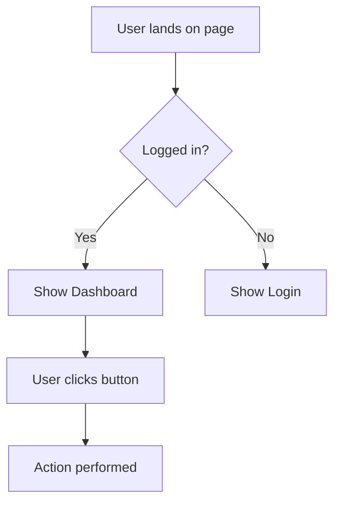

# UI Mockup: [Component/Page Name]

## Overview
_Brief description of this UI component or page_

---

## Desktop View

```
┌─────────────────────────────────────────────────────────────────┐
│  Header                                                     [X] │
├─────────────────────────────────────────────────────────────────┤
│                                                                  │
│  [Your UI mockup here]                                          │
│                                                                  │
│  ┌──────────────┐  ┌──────────────┐  ┌──────────────┐         │
│  │  Component 1 │  │  Component 2 │  │  Component 3 │         │
│  │              │  │              │  │              │         │
│  └──────────────┘  └──────────────┘  └──────────────┘         │
│                                                                  │
├─────────────────────────────────────────────────────────────────┤
│  Footer                                                          │
└─────────────────────────────────────────────────────────────────┘
```

### Desktop Specifications
- Width: 1920px (max-width)
- Breakpoint: ≥ 1024px
- Layout: [Grid/Flexbox/etc.]

---

## Tablet View

```
┌──────────────────────────────┐
│  Header                  [≡] │
├──────────────────────────────┤
│                              │
│  [Tablet layout]             │
│                              │
│  ┌────────────────────────┐  │
│  │   Component Stacked    │  │
│  └────────────────────────┘  │
│                              │
└──────────────────────────────┘
```

### Tablet Specifications
- Width: 768px - 1023px
- Changes from desktop: [list changes]

---

## Mobile View

```
┌─────────────────┐
│  ☰          [X] │
│   App Name      │
├─────────────────┤
│                 │
│  [Mobile]       │
│  [Layout]       │
│                 │
│  ┌───────────┐  │
│  │ Component │  │
│  └───────────┘  │
│                 │
└─────────────────┘
```

### Mobile Specifications
- Width: < 768px
- Changes from tablet: [list changes]

---

## Component Details

### Component 1: [Name]
- **Purpose:** Description
- **States:** Default, Hover, Active, Disabled
- **Interactions:** Click, Drag, etc.

### Component 2: [Name]
- **Purpose:** Description
- **States:** Default, Hover, Active, Disabled
- **Interactions:** Click, Drag, etc.

---

## User Interactions

### Interaction Flow


---

## States & Variants

### Loading State
```
┌─────────────────┐
│   ⟳ Loading...  │
└─────────────────┘
```

### Empty State
```
┌─────────────────┐
│   📭            │
│   No items yet  │
│   [+ Add Item]  │
└─────────────────┘
```

### Error State
```
┌─────────────────┐
│   ⚠️ Error      │
│   [Retry]       │
└─────────────────┘
```

---

## Accessibility Notes
- Keyboard navigation: [describe]
- Screen reader support: [describe]
- ARIA labels: [list important labels]
- Color contrast: [meets WCAG AA/AAA]

---

## Design Tokens (if applicable)

### Colors
- Primary: `#color`
- Secondary: `#color`
- Error: `#color`

### Spacing
- Small: 8px
- Medium: 16px
- Large: 24px

### Typography
- Heading: Font, Size, Weight
- Body: Font, Size, Weight

---

## Implementation Notes
- Framework/Library: [React, Vue, etc.]
- Component path: `/components/[name]`
- Styling approach: [CSS Modules, Styled Components, etc.]

---

## Related
- Gherkin Scenarios: `feature.gherkin`
- User Flow: `flow.md`
- Component Hierarchy: Link to diagram
